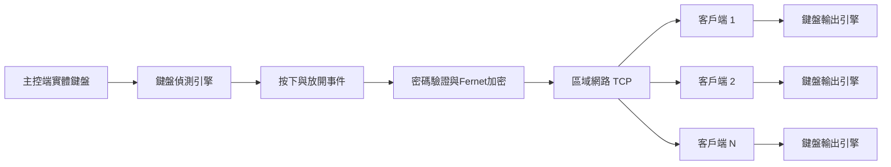

# LAN KeySync

**LAN KeySync**是一套適用於Windows區域網路的鍵盤同步工具。  
它可以將一台主控端電腦的實體鍵盤操作，即時同步到一台或多台客戶端電腦。

專案使用PySide6建立Qt圖形介面，並提供多種Windows鍵盤偵測與輸出引擎，讓一般桌面程式與部分遊戲環境都能選擇較合適的輸入方式。

> 本工具只應用於本人擁有、管理，或已取得明確授權的電腦。

---

## 主要功能

- 一台主控端可同時連接多台客戶端
- 同步鍵盤按下與放開事件
- UDP自動搜尋區域網路內的主控端
- 支援手動輸入主控端IP
- 使用共用密碼進行連線驗證
- 鍵盤事件使用Fernet加密傳輸
- 客戶端斷線後可自動重新連線
- 主控端可隨時暫停或恢復同步
- 客戶端可停用遠端輸入
- 客戶端提供緊急釋放所有按鍵
- 支援Windows系統管理員權限啟動
- 支援PyInstaller打包成獨立EXE
- 相容Python 3.10～3.14

---

## 系統架構



預設網路連接埠：

| 用途 | 協定 | 預設連接埠 |
|---|---:|---:|
| 客戶端連線與鍵盤事件傳輸 | TCP | 50101 |
| 區域網路主控端搜尋 | UDP | 50100 |

---

## 主控端鍵盤偵測引擎

主控端可以在Qt介面中切換不同的鍵盤偵測方式。

| 偵測引擎 | 說明 | 建議用途 |
|---|---|---|
| BetterGI相容全域鉤子 | 使用Windows `WH_KEYBOARD_LL`低階全域鍵盤鉤子 | 建議優先使用 |
| Win32按鍵狀態輪詢 | 每2ms讀取`GetAsyncKeyState` | 遊戲無法被全域鉤子截取時 |
| pynput | 原始`pynput.Listener`方式 | 一般桌面程式或相容性比較 |

主控端會顯示：

- 最後偵測到的按鍵
- 按下或放開狀態
- 已收到的鍵盤事件總數

這可以用來確認問題發生在「主控端未偵測到輸入」，還是「客戶端未成功輸出按鍵」。

---

## 客戶端鍵盤輸出引擎

客戶端也可以切換不同的Windows鍵盤輸出方式。

| 輸出引擎 | 說明 | 建議用途 |
|---|---|---|
| BetterGI相容SendInput | 使用Virtual-Key形式的Win32 `SendInput` | 建議優先使用 |
| PyAutoGUI | 使用`pyautogui.keyDown()`及`keyUp()` | 已確認PyAutoGUI有效的程式 |
| DirectInput掃描碼 | 使用掃描碼形式的`SendInput` | 部分DirectX程式 |

客戶端提供「3秒後測試F鍵」功能，可在尚未連線主控端前，快速確認目前選擇的輸出引擎能否控制目標程式。

---

## 執行需求

- Windows 10或Windows 11
- Python 3.10以上
- 建議使用64位元Python
- 主控端與客戶端建議都以系統管理員身分執行
- 兩台電腦需位於可互相連線的區域網路

安裝套件：

```powershell
py -m pip install -r requirements.txt
```

也可以直接執行：

```text
install_requirements.bat
```

---

## 快速開始

### 1. 啟動主控端

執行：

```text
run_server.bat
```

或：

```powershell
py server_qt.py
```

操作步驟：

1. 輸入至少8碼的共用密碼。
2. 選擇鍵盤偵測引擎。
3. 按下「啟動主控端」。
4. 第一次執行時，允許Windows防火牆的私人網路存取。
5. 切換到目標程式或遊戲，確認「最後偵測」持續更新。

### 2. 啟動客戶端

執行：

```text
run_client.bat
```

或：

```powershell
py client_qt.py
```

操作步驟：

1. 選擇鍵盤輸出引擎。
2. 使用「3秒後測試F鍵」確認輸出是否有效。
3. 按下「自動搜尋」，或手動輸入主控端IP。
4. 輸入與主控端相同的共用密碼。
5. 按下「連線」。
6. 連線後，主控端鍵盤操作會同步到客戶端。

---

## 快捷操作

### 主控端

按下`Pause`鍵可切換：

- 鍵盤同步開啟
- 鍵盤同步暫停

`Pause`鍵本身不會被傳送到客戶端。

### 客戶端

客戶端可隨時：

- 取消「允許主控端輸入」
- 按下「緊急釋放所有按鍵」
- 主動中斷連線

停用輸入或斷線時，程式會嘗試釋放目前按住的Ctrl、Alt、Shift及其他按鍵。

---

## Windows防火牆

主控端預設需要允許：

- TCP 50101
- UDP 50100

可在系統管理員PowerShell建立規則：

```powershell
New-NetFirewallRule `
  -DisplayName "LAN KeySync TCP" `
  -Direction Inbound `
  -Protocol TCP `
  -LocalPort 50101 `
  -Action Allow `
  -Profile Private

New-NetFirewallRule `
  -DisplayName "LAN KeySync UDP Discovery" `
  -Direction Inbound `
  -Protocol UDP `
  -LocalPort 50100 `
  -Action Allow `
  -Profile Private
```

若自動搜尋失敗，但手動輸入IP可以連線，常見原因包括：

- Windows防火牆阻擋UDP
- 無線AP啟用用戶端隔離
- 使用訪客Wi-Fi
- 主控端與客戶端位於不同VLAN
- 路由器不轉送UDP廣播

---

## 打包成EXE

執行：

```text
build_exe.bat
```

完成後，`dist`資料夾會產生：

```text
LAN_KeySync_Qt_Server.exe
LAN_KeySync_Qt_Client.exe
```

主控端與客戶端EXE皆設定為啟動時要求系統管理員權限。

---

## 專案結構

```text
LAN-KeySync/
├─ server_qt.py
├─ client_qt.py
├─ keysync_server_core.py
├─ keysync_client_core.py
├─ keysync_common.py
├─ keyboard_capture_backends.py
├─ keyboard_backends.py
├─ directinput_backend.py
├─ qt_style.py
├─ requirements.txt
├─ install_requirements.bat
├─ run_server.bat
├─ run_client.bat
├─ build_exe.bat
├─ CHANGELOG_GameCapture.md
├─ CHANGELOG_MultiEngine.md
├─ CHANGELOG_Python314_Fix.md
└─ README.md
```

### 核心模組

| 檔案 | 功能 |
|---|---|
| `server_qt.py` | 主控端Qt圖形介面 |
| `client_qt.py` | 客戶端Qt圖形介面 |
| `keysync_server_core.py` | 主控端連線、驗證、加密及事件廣播 |
| `keysync_client_core.py` | 客戶端連線、解密、重連及按鍵執行 |
| `keyboard_capture_backends.py` | 主控端鍵盤偵測引擎 |
| `keyboard_backends.py` | 客戶端鍵盤輸出引擎 |
| `keysync_common.py` | 共用驗證、封包及按鍵格式 |
| `qt_style.py` | Qt樣式表 |

---

## 安全設計

目前包含以下基本安全措施：

- 使用共用密碼進行HMAC驗證
- 密碼不會直接透過網路傳送
- 使用隨機Challenge避免直接重播驗證資料
- 鍵盤事件使用Fernet對稱加密
- 客戶端可停用遠端輸入
- 斷線時釋放目前按住的按鍵
- 主控端預設忽略軟體注入的鍵盤事件
- 不儲存使用者輸入的共用密碼

仍建議：

- 只在可信任的私人區域網路使用
- 不要將TCP或UDP連接埠轉發至網際網路
- 不要使用容易猜測的密碼
- 輸入帳號密碼或付款資料前先暫停同步

---

## 疑難排解

### 主控端切換到遊戲後無法偵測按鍵

1. 使用系統管理員身分執行`run_server.bat`。
2. 確認主控端介面的事件數是否增加。
3. 先測試「BetterGI相容全域鉤子」。
4. 若仍無事件，切換成「Win32按鍵狀態輪詢」。
5. 避免使用Windows UAC安全桌面或登入畫面測試。

### 客戶端一般程式可以控制，但遊戲無法控制

1. 使用系統管理員身分執行客戶端。
2. 確認遊戲視窗位於前景並取得鍵盤焦點。
3. 使用「3秒後測試F鍵」測試輸出引擎。
4. 依序測試BetterGI相容SendInput、PyAutoGUI及DirectInput掃描碼。
5. 確認遊戲與客戶端使用相同權限層級。

### 按鍵卡住

按下客戶端的：

```text
緊急釋放所有按鍵
```

也可以停用「允許主控端輸入」或中斷連線。

---

## 已知限制

- 僅支援Windows
- 無法控制Windows登入畫面
- 無法控制UAC安全桌面
- UDP自動搜尋通常無法跨越不同VLAN或子網路
- 部分使用Raw Input、核心層反作弊或主動封鎖模擬輸入的程式可能不接受輸入
- 不保證支援所有遊戲
- 本專案不包含繞過反作弊、安全防護或遊戲偵測的功能

---

## 致謝

本專案在Windows鍵盤鉤子與`SendInput`相容性設計上，參考了BetterGI公開專案的相關實作概念：

- [BetterGI](https://github.com/babalae/better-genshin-impact)
- [PyAutoGUI](https://github.com/asweigart/pyautogui)
- [pynput](https://github.com/moses-palmer/pynput)
- [PySide6](https://doc.qt.io/qtforpython-6/)

LAN KeySync與上述專案沒有官方從屬或合作關係。

---

## 授權

目前專案尚未加入開源授權檔案。

在加入MIT、Apache-2.0、GPL-3.0或其他授權前，程式碼的使用、修改與再散布權利仍由原作者保留。
